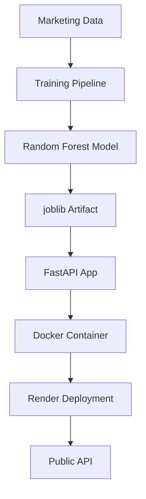
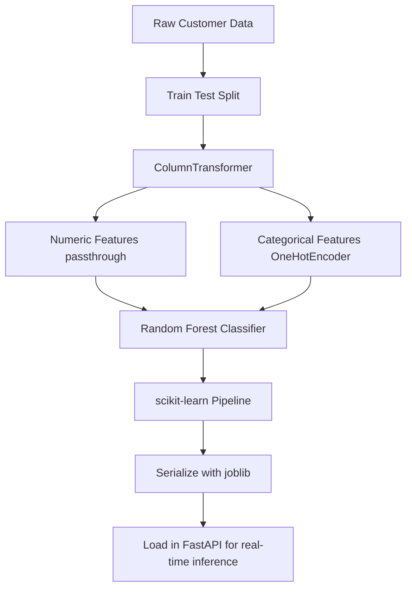

# Marketing Conversion Prediction API

A production-ready machine learning REST API for predicting customer conversion probability using FastAPI, Docker, and Render.

## Live Demo

- API URL: https://marketing-conversion-api.onrender.com/
- Swagger Docs: https://marketing-conversion-api.onrender.com/docs

## Overview

This project demonstrates an end-to-end machine learning deployment workflow by serving a Random Forest classification model through a FastAPI REST API. The application is containerized with Docker and deployed on Render, enabling real-time customer conversion predictions through a publicly accessible API.

## Business Problem

Marketing teams invest significant resources into acquiring leads, but not every prospect is equally likely to convert. This project predicts the probability that a customer will convert based on demographic, behavioral, and marketing engagement features, enabling businesses to prioritize high-value prospects and optimize sales outreach.

## Feature Inputs

- Age
- Annual income
- Country
- Device type
- Traffic source
- Campaign type
- Pages visited
- Session duration
- Email opens
- Email clicks
- Previous purchases
- Days since last visit
- Discount offered
- Ad spend

## Tech Stack

- Python
- scikit-learn
- FastAPI
- Pydantic
- Docker
- Render
- pandas
- NumPy

## Architecture Diagram



## Machine Learning Pipeline



## Project Structure

```text
marketing-conversion-api/
├── app/
│   ├── __init__.py
│   ├── main.py
│   ├── predictor.py
│   └── schemas.py
├── data/
│   └── marketing_conversion_data.csv
├── models/
│   └── marketing_conversion_model.joblib
├── notebooks/
│   └── marketing_eda.ipynb
├── reports/
│   └── metrics.json
├── tests/
├── training/
│   ├── __init__.py
│   ├── generate_data.py
│   └── train.py
├── Dockerfile
├── README.md
├── main.py
└── pyproject.toml
```

## Installation

### Prerequisites

- Python 3.13+
- uv
- Docker Desktop (optional for containerized deployment)
- Git

### Clone the Repository

```bash
git clone https://github.com/ileon4/marketing-conversion-api.git
cd marketing-conversion-api
```

### Install Dependencies

```bash
uv sync
```

### Run the API Locally

```bash
uv run uvicorn app.main:app --reload
```

Open: http://127.0.0.1:8000/docs

## Docker Usage

### Build Image

```bash
docker build -t marketing-conversion-api .
```

### Run Container

```bash
docker run \
        --name marketing-conversion-container \
        -p 8000:8000 \
        marketing-conversion-api
```

Open: http://127.0.0.1:8000/docs

### Stop Container

```bash
docker stop marketing-conversion-container
```

## API Endpoints

### Live API

https://marketing-conversion-api.onrender.com

### Interactive Documentation

https://marketing-conversion-api.onrender.com/docs

### Health Check

Endpoint: GET /

Response:

```json
{
        "message": "Marketing Conversion API is running!"
}
```

### Predict Customer Conversion

Endpoint: POST /predict

Request:

```json
{
        "age": 42,
        "annual_income": 95000,
        "country": "United States",
        "device_type": "Mobile",
        "traffic_source": "Organic Search",
        "campaign_type": "Email",
        "pages_visited": 12,
        "session_duration": 390,
        "email_opens": 4,
        "email_clicks": 2,
        "previous_purchases": 3,
        "days_since_last_visit": 7,
        "discount_offered": 10,
        "ad_spend": 45.5
}
```

Response:

```json
{
        "prediction": "Highly Likely to Convert",
        "conversion_probability": 0.9557,
        "recommendation": "This customer appears to be a strong prospect. Recommend immediate sales outreach."
}
```

## Model Performance

Metrics are generated by training/train.py and saved in reports/metrics.json.

| Metric | Value |
| --- | ---: |
| Accuracy | 0.7104 |
| Precision | 0.6180785612872692 |
| Recall | 0.6707755521314843 |
| F1-score | 0.6433497536945813 |
| ROC-AUC | 0.7820059954331885 |

Confusion Matrix:

| Actual \ Predicted | Negative | Positive |
| --- | ---: | ---: |
| Negative | 2246 | 807 |
| Positive | 641 | 1306 |

Note: Performance metrics are reported on a held-out test set generated from the synthetic marketing conversion dataset. The primary objective of this project is to demonstrate an end-to-end machine learning deployment workflow rather than optimize a production model.